# Bike-Ride

BikeRide is a activity sharing site for anyone that has a good story to tell about there experince or an idea. It provides users a clear and simple way to browse and share ideas on things to keep kids entertained.

# User-Experience-Design

## Site Goals

The site is aimed at anyone that has an interesting story to tell about there expericen or an idea. Without signing in the user can browse posts and see other people storyes. They will also be able to log on and share ideas of their own and comment on other people’s posts. They will also be able to edit and delete their posts.

## Agile Planning

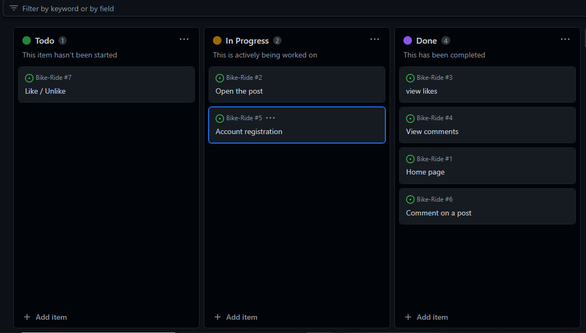

This project was developed using agile methodologies. All the features had to be done to make this web so user could use it. All the features were added from a agile. 

# Scope

Home page with information about BikeRide.
Restricted features for not logged in users.

## Structure

Navbar
user story - As a user I want to be able to navigate easily around the site easily from any devise

Navigation Menu
When the user is not logged in the navigation menu links to the Home page, Ride Blog page, Register and the Login in page

Once the user has signed in the navigation menu changes to Home, Ride Blog, Create a post and Logout

The user will also receive a message saying they have successfully signed in.

on smaller devices, the menu options collapse into a button

## Home page

User Story - As a user I want the front page to be clear and self-explanatory so I know I am in the right place

The front page contains a main image of the bike on the road. This will make it evident to the user that the website is about the bike rides.

Under this image is information about the site and how to share and browse rides.

## Footer

User Story: As site owner, I want to share social media links and contact details

The Footer has been added to the bottom of the site and contains links to social media sites so that users can also share their posts and promote the site via social media.

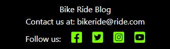

## RideBlog

User Story: As a user that is not logged in, I want to be able to browse posts from other users.

Anybody can use the website to browse post, they are shown in the Ride Blog page with the titles and pictures in rows of 3 and 6 posts per page. The post Title is a link to open up each post with further information about it. Also You can read the beginning of the post.

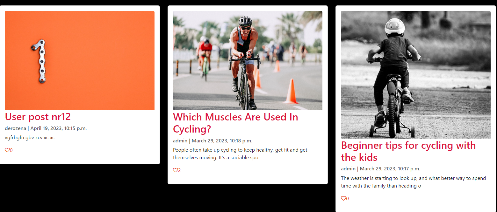

## Post Details

User Story: As a user, I want to be able to comment and like otherpeople’s posts

Each user story opens up to a full page which contains the image, a full content of the post and read post comments.

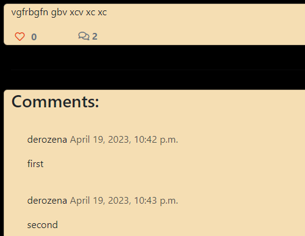

Logged-on users can also comment on and like the posts.

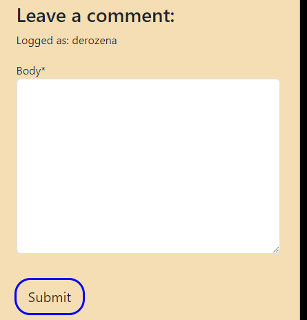

## Sign in, Sign up, Sign out

As a new user, you are able to sign up easily.
As a returning user, you are able to log in easily.
As a user, you are able to log out of the site safely and easily.
As a developer, I want to ensure the forms are all the same style and look good on all devices.

Users can sign in and out using forms and confirmation pages. These forms were made using allauth and edited using bootstrap.

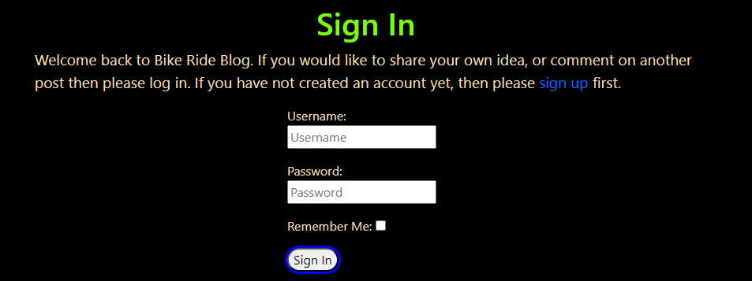

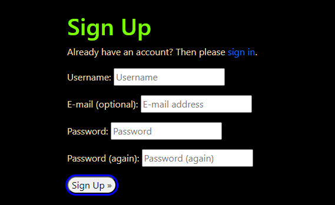

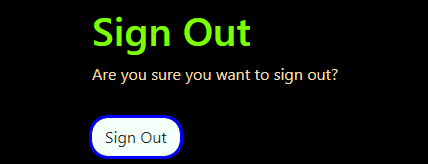

## Create Post

User Story: As a user, I want to be able to input my own post.

Once the user is logged in they can create their own post using the create post form.

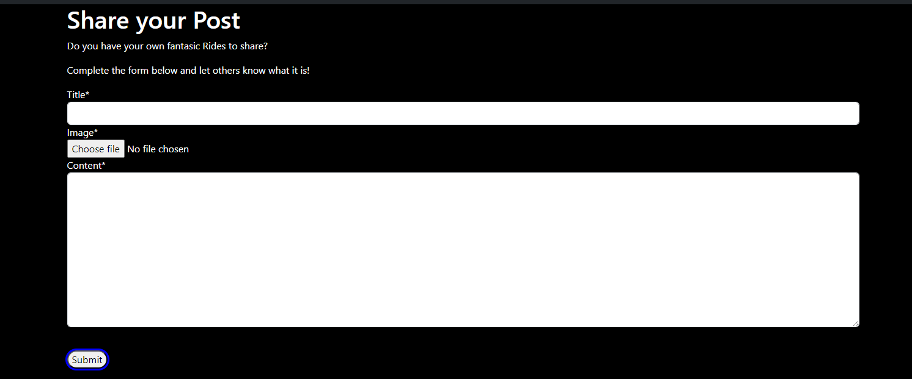

## Edit and Delete Post

As a user, you are able to edit post that you have created.
As a user, you are able to delete post that you have created.
As the site owner I want to ensure only the creator of an post can edit or delete it.

The creator of an post will be able to view edit and delete icons on their post detail page. The edit button will take them to the edit post form but it will be pre-populated with information that is already saved. The user can then update the information and save it again where they will be redirected back to the post page.

They will get a message to advise them that their creation/edit has been successful.

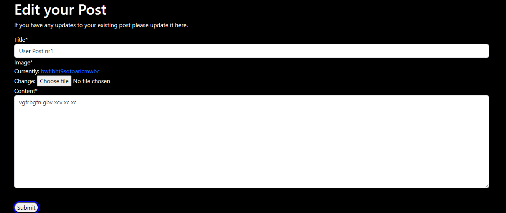

The delete button will take the user to a confirmation page asking them to confirm they wish to delete that post. Once an post is deleted all comments will be deleted with it.

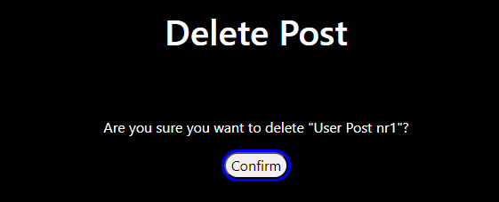

The delete and edit views use LoginRequiredMixin and UserPassesTestMixin to ensure that only the post creator who is logged in can update or delete their post.

## Database

The data was designed to give the user CRUD functionality once signed in. Posts are connected to the author by foreign key which allows users to edit and delete pots connected to their account.

## Security

Views were secured by using the django based view mixin, UserPassesTestMixin. A test function was created to use the mixin and checks that the user is authorised to access the page, an if statement is also used in post_detail.html to hide the delete and edit buttons if the user is not authorised.

## Images

All the images are used from [pexels](https://www.pexels.com/).

# Technologies

- HTML
    - The structure of the site was made using HTML
- CSS
    - The website was styled using CSS in an external stylesheet
- Python
    - Python was the main programming language used within the django app
- Github
    - Source code was hosted in Github
- javascript
    - I used a very small amount of javascript to make the messages disappear

# Testing

## Navigation Links

Testing was performed on on all navigation links throughout the site. I achieved this by clicking on each link to ensure it went to the correct place.

All navigation links worked as expected

## Footer

All the font awesome icons in the footer opened to their respective websites, in a new window, as expected.

## Login Page

Testing was taken out to ensure a user could login to the website.
- Enter User Name and Password
- Click Sign Up

Outcome: User is redirected to the home page. The Navbar changed to show the create a post option and log out option.

## Log out Page

Testing was taken out to ensure a user could log out of the website.

- Navigate to Log Out page
- Click Confirm button

Outcome: User is taken back to the homepage with the Create post option hidden and the Register option showing.

## Log in page

Testing was taken out to ensure a user could log in to the website.

- Navigate to LogIn page
- Enter User Name and Password
- Click Sign in

Outcome: User is redirected to the home page. The Navbar changes to show the create a post option and log out options. A message appears to say they have successfully logged in.

## Create post Page

Testing was taken out to ensure the user could create a new post.

When the user is logged in.

- Navigate to create a post page
- Complete form
    - Title
    - Add image
    - Content of the post
- Click Submit

Outcome if all fields are filled in correctly the user will be redirected to the Ride Blog page where they can view their post. A message appears to say they have successfully created their post.

## Edit Post

Tested to ensure the user could edit their post.

When the user is logged in

- If the user is the Author of the post, they will see a delete button and an Edit button under the post Name
- Click the edit button
- Update the fields you wish to update
- Click Submit

Outcome: The user will be redirected back to the Ride Blog page which will show the new information, and a message appears to say they have succesfully updated their post.

## Delete a post

Tested to ensure a user could delete their post.

When the user is logged in

- Click on the post name
- If the user is the Author of the post, they will see a delete button and an Edit button under the Post Name
- Click the delete button
- User is taken to a Delete confirmation page asking them if their wish to delete that post showing the post name.
- Click Submit

Outcome: The user will be redirected back to the Ride Blog page and the post along with the comments will be deleted.

## Comment on a post

First I checked the comment section when the user is Logged out. As expected there is no option to enter a comment at all. You can view other people’s comments but the box to write your own comment is hidden.

When the user is logged in.

- Click on the post name
- scroll down to the comments section.
- Write your comment in the comments box.
- Click submit

The comment will appear in the comment section to the left of the comment box.

## Validator Testing

All pages were run through the [Html Checker](https://validator.w3.org/nu/). All issues were fixed and all pages ran through the checker with no errors.
Due to the use of django language within the HTML files to complete this check I had to retrieve the html code from the open web page and right-click to view the source code. I could then copy and paste this into the html checker.

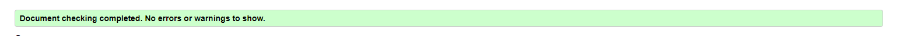

## Deployment

To deploy my site to Heroku I followed the following steps

- Navigate to heroku and create/log into account
- Click the new button in the top right corner
- Select create new app
- Enter app name
- Select region and click create app (europe)
- Click the resources tab and search for Heroku Postgres
- Go to the settings tab and then click reveal config vars
- Add config vars
- Click the deploy tab
- Scroll down to Connect to GitHub and sign in / authorize when prompted
- In the search box, find the repository you want to deploy and click connect
- Scroll down to Manual deploy and choose the main branch
- Click Deploy

## References

- I also followed the Code Institute Blog walkthrough to start my project off.
- I used the django documentation
- I used the summernote documentation
- I used the bootstrap documentation

## PP8 Validator

All pages were run through the . There were some errors, for example, lines to long and whitespace.

# Acknowledgements

- My mentor
- The wonderful slack community
- My girlfriend for putting up with my stress